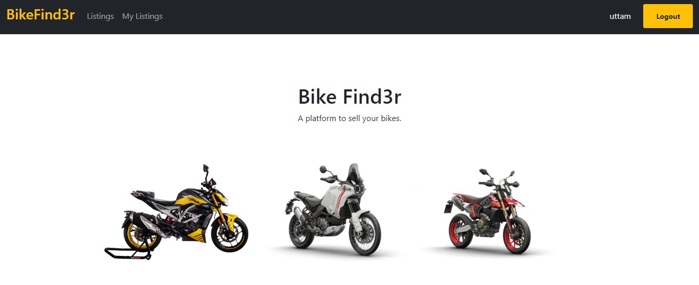
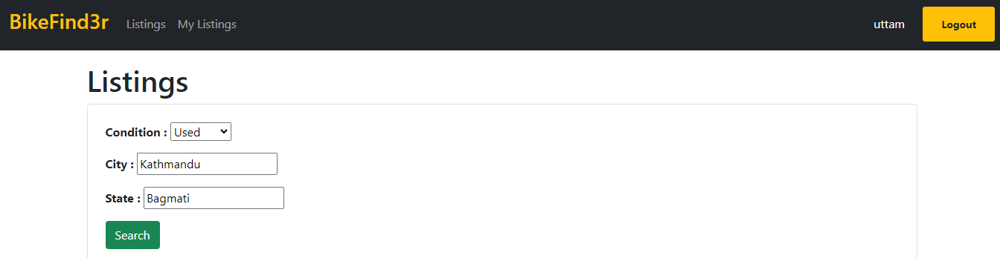
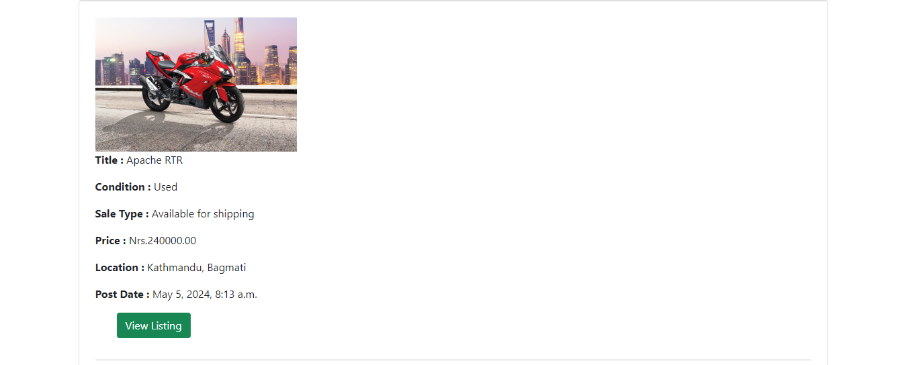

# BikeFind3r

BikeFind3r application is built using Django, which allows you to list your bike and it's part for sale/buy. You can directly call the owner if you are interested to buy one.

## Prerequisites

- Text Editor (VS Code)
- Git
- Python 3.4 or above
- Django 4.2

## Built with

- Python
- HTML
- Bootstrap

## Installation

1. Clone the repository to your local machine.

```
git@github.com:uttamshr10/BikeFind3r.git
```

2. Navigate to `cd BikeFind3r`

3. Create virtual environment.

```
virtualenv env
```

4. Activate the environment.

```
env/Scripts/activate
```

5. Install the required dependencies.

```
pip install -r requirements.txt
```

6. Start the development server.

```
python manage.py runserver
```

7. Open your web browser and visit `http://127.0.0.1:8000/` to access the BikeFind3r application.

<p align="center"><b>Home Page</b></p>



<p align="center"><b>Listings</b></p>




<p align="center"><b>My Listings</b></p>


# Author

## Uttam Shrestha

[](https://www.linkedin.com/in/uttam-shrestha-b96032224/)

[](https://github.com/uttamshr10)

# Contributing

Contributions are welcome! If you find any bugs or have any suggestions for improvements, please create an issue or a pull request.

# Contact

If you have any questions or feedback, feel free to contact me at utam.shrestha65@gmail.com
